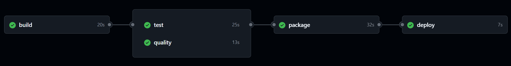

# Pipeline CI/CD & Déploiement

Cette section décrit le fonctionnement de la **pipeline d’intégration et de déploiement continu (CI/CD)** mise en place avec **GitHub Actions**, **Docker Hub** et **Render**.

La pipeline permet d’automatiser :

- L'installation de **Python** et les **dépendances**
- Le lancement des tests **unitaires** et d'**intégration**
- La vérification de la **couverture de tests**
- La construction de **l'image Docker**
- Le déploiement de l'application sur **Render**

Chaque étape est déclenchée **à chaque push ou pull request**, mais le **déploiement Render** ne s’effectue que sur la branche `master`.

## Structure du workflow GitHub Actions

Le fichier du workflow se trouve ici :

```text
.github/
└── workflows/
    └── pipeline-ci-cd.yml
```

## Déroulement de la pipeline

### 1. Étape `build`

Cette première étape installe Python et les dépendances.

```yaml
build:
  runs-on: ubuntu-latest
  steps:
    - uses: actions/checkout@v4
    - name: Set up Python
      uses: actions/setup-python@v3
      with:
        python-version: "3.12.4"
    - name: Install dependencies
      run: |
        pip install -r requirements.txt
```

### 2. Étape `test`

Les tests unitaires et d'intégration sont exécutés avec `pytest`.

La couverture minimale de test est fixée à **80 %**.

```yaml
test:
  runs-on: ubuntu-latest
  needs: build
  steps:
    - uses: actions/checkout@v4
    - name: Set up Python
      uses: actions/setup-python@v3
      with:
        python-version: "3.12.4"
    - name: Install dependencies
      run: |
        pip install -r requirements.txt
    - name: Run tests
      run: |
        pytest
        pytest --cov=. --cov-fail-under=80
```

### 3. Étape `quality`

Vérifie la syntaxe et la qualité du code avec **Flake8**, pour garantir le respect de la norme PEP8.

```yaml
quality:
  runs-on: ubuntu-latest
  needs: build
  steps:
    - uses: actions/checkout@v4
    - name: Set up Python
      uses: actions/setup-python@v3
      with:
        python-version: "3.12.4"
    - name: Install linter
      run: |
        pip install flake8
    - name: Run flake8
      run: flake8 .
```

### 4. Étape `package`

Une fois les tests et le linting validés, l’image Docker est **construite** et **publiée sur Docker Hub** (avec le hash du commit).

> ⚠️ Cette étape ne s’exécute **que sur la branche `master`**.

```yaml
package:
  runs-on: ubuntu-latest
  needs: [test, quality]
  if: github.ref == 'refs/heads/master'
  permissions:
    contents: read
  steps:
    - uses: actions/checkout@v4

    - name: Get short SHA for the last commit
      id: vars
      run: echo "GIT_SHA=$(git log -1 --pretty=format:'%h')" >> $GITHUB_ENV

    - name: Log in to Docker Hub
      uses: docker/login-action@v2
      with:
        username: ${{ secrets.DOCKERHUB_USERNAME }}
        password: ${{ secrets.DOCKERHUB_TOKEN }}

    - name: Build Docker image
      run: |
        docker build -t ${{ secrets.DOCKERHUB_USERNAME }}/oc-project-13:${{ env.GIT_SHA }} .

    - name: Push Docker image
      run: |
        docker push ${{ secrets.DOCKERHUB_USERNAME }}/oc-project-13:${{ env.GIT_SHA }}
```

### 5. Étape `deploy`

Une fois l’image Docker mise à jour, Render est notifié via un **webhook** (`RENDER_DEPLOY_HOOK`) pour lancer automatiquement un **nouveau déploiement** de l’application.

```yaml
deploy:
  runs-on: ubuntu-latest
  needs: package
  if: github.ref == 'refs/heads/master'
  steps:
    - name: Trigger Render deploy
      run: curl -X POST ${{ secrets.RENDER_DEPLOY_HOOK }}
```

## Secrets GitHub utilisés

| Nom du secret        | Description                                      |
| -------------------- | ------------------------------------------------ |
| `DOCKERHUB_USERNAME` | Nom d’utilisateur Docker Hub                     |
| `DOCKERHUB_TOKEN`    | Token d’accès Docker Hub                         |
| `RENDER_DEPLOY_HOOK` | URL du webhook Render déclenchant le déploiement |

> 💡 Ces secrets sont configurés dans l’interface GitHub :
> `Settings → Secrets and variables → Actions`


## Résumé du flux CI/CD



## Déploiement sur Render

L’application est hébergée sur **[Render](https://render.com)**, une plateforme cloud permettant de déployer automatiquement l’application dès qu’une nouvelle image Docker est disponible sur **Docker Hub**.

### Configuration Render

- **Type de service :** Web Service
- **Public Git Repository :** https://github.com/Matthieu-Chambon/OC_Projet_13
- **Name :** OC_Lettings
- **Language :** Docker
- **Branch :** Master
- **Region :** Frankfurt (EU Central)
- **Auto-Deploy :** Off

Une fois le service Render créé, récupérez l’URL du **Deploy Hook** depuis l’onglet **Settings** → **Deploy Hook**, puis ajoutez-la dans les variables **GitHub Actions** sous le nom `RENDER_DEPLOY_HOOK`.

### Déploiement automatique

Lorsqu’un commit est **poussé sur la branche `master`** :

1. GitHub Actions exécute les tests et vérifie la qualité du code
2. Une fois les vérifications passées, la pipeline envoie une requête au **Deploy Hook Render** (`RENDER_DEPLOY_HOOK`)
3. Render récupère automatiquement la **dernière version du code GitHub** (branche `master`), **reconstruit l’image Docker** à partir du `Dockerfile`, et **redéploie** le service